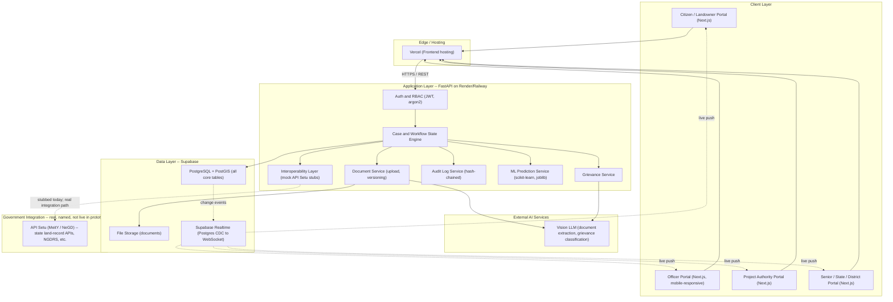
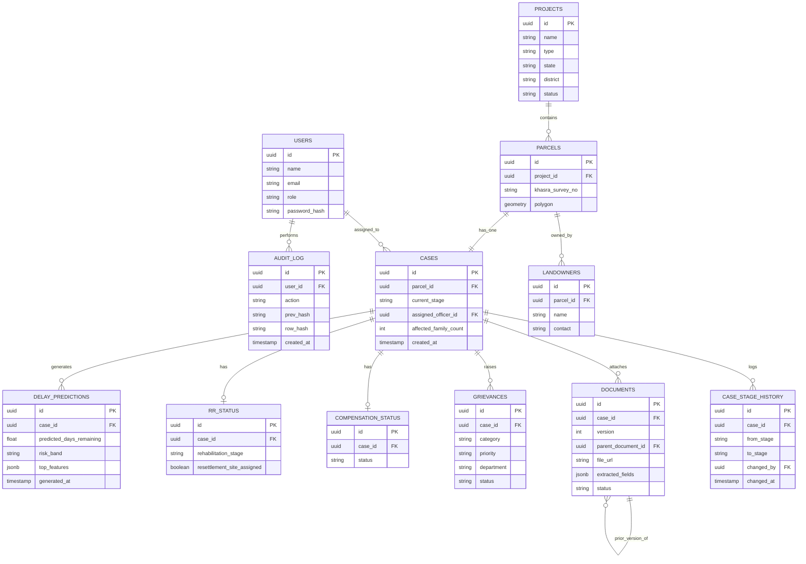
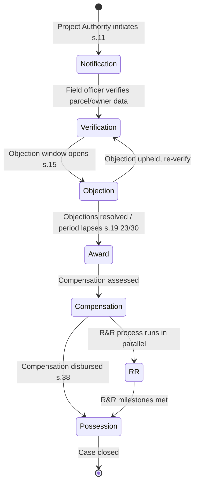
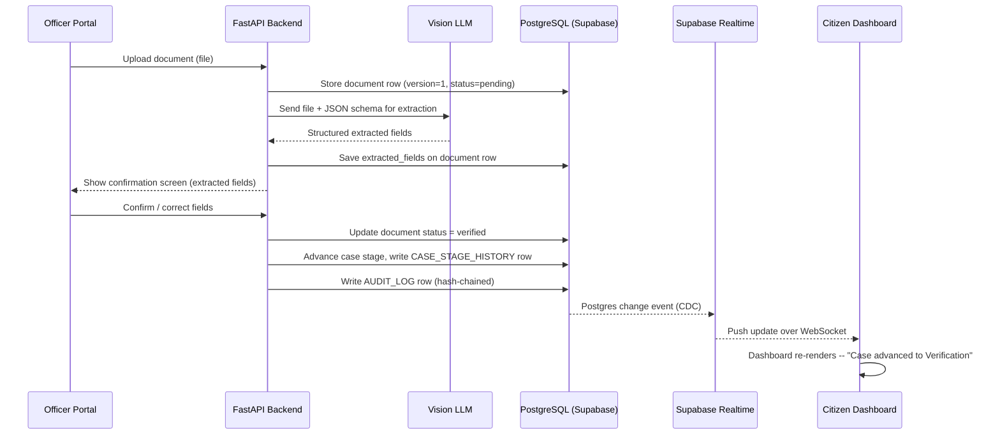

# BhoomiSetu — Central Master Plan
### SIH26016 — Real-Time National Land Acquisition & Management System

This is the **central reference doc**. Keep this chat open as the coordination point. Each phase below has its own standalone `.md` file — open a fresh Claude chat per phase and paste that file in, so each phase gets full context without dragging the whole conversation history along.

**Phase docs:**
1. `Phase1_Foundation_Backend.md` — repo, DB, auth, RBAC, core CRUD, workflow engine
2. `Phase2_Frontend.md` — all 5 role portals, shared shell, map integration
3. `Phase3_AI_ML_GIS.md` — document extraction, grievance classification, predictive analytics, PostGIS/Leaflet
4. `Phase4_Interop_Realtime_Audit.md` — mock API Setu layer, Supabase Realtime, audit log
5. `Phase5_DevOps_Testing_Deploy.md` — CI/CD, testing, deployment, demo prep

---

## Table of Contents
1. [On API Setu — can we actually use it?](#1-on-api-setu--can-we-actually-use-it)
2. [Positioning & Pitch Framing](#2-positioning--pitch-framing)
3. [Complete Feature List](#3-complete-feature-list)
4. [Complete Technology Stack](#4-complete-technology-stack)
5. [System Architecture Diagram](#5-system-architecture-diagram)
6. [Data Model / ER Diagram](#6-data-model--er-diagram)
7. [Workflow / State Machine Diagram](#7-workflow--state-machine-diagram)
8. [Request Flow — Document Upload to Timeline Update](#8-request-flow--document-upload-to-timeline-update)
9. [Predictive Analytics (ML) — Scope Decision](#9-predictive-analytics-ml--scope-decision)
10. [Role → Screen Map](#10-role--screen-map)
11. [Feature Tiering (MVP vs Secondary)](#11-feature-tiering-mvp-vs-secondary)
12. [Judging-Criteria Self-Check](#12-judging-criteria-self-check)
13. [Key Risks & Mitigations](#13-key-risks--mitigations)

---

## 1. On API Setu — can we actually use it?

Yes, it's real — you should name it explicitly in the pitch — but you cannot get live production access to it in a week.

- **API Setu** (apisetu.gov.in) is an official Open API platform run by **NeGD, under MeitY, Government of India**. Real, currently operating.
- It hosts genuine land-record APIs from multiple states: Karnataka Revenue Department (`landrecordskar`), Goa Department of Registration, Telangana Registration & Stamps, and **NGDRS** (National Generic Document Registration System) — confirmed live in the API directory.
- **Access requires:** consumer registration on API Setu, then subscription, then **publisher approval**. This is a real onboarding workflow, not an anonymous API key. Approval for state land-record APIs is meant for verified government/institutional consumers — not realistically completable by a student team in a week.

### What this means for your build
1. **Name API Setu specifically** in architecture and pitch as the real, existing integration point you're designed to plug into.
2. **Build a stub layer** mimicking API Setu's interface shape — a couple of FastAPI routes (e.g. `/integrations/apisetu/land-records/{khasra_id}`) returning realistic fake responses shaped like a real NGDRS/state API.
3. **Say this explicitly to judges:** *"BhoomiSetu is designed to consume land-record data through API Setu — the Government of India's own Open API platform — via the same consumer-registration and subscription workflow. For this prototype we've stubbed those calls with a fixture layer matching the real API Setu response shape; in production this would go through official consumer onboarding on apisetu.gov.in."* Honest, specific, and raises credibility rather than exposing a gap.

Full stub implementation details are in `Phase4_Interop_Realtime_Audit.md`.

---

## 2. Positioning & Pitch Framing

BhoomiSetu is an **orchestration/interoperability layer**, not a replacement for BhoomiRashi/DILRMP/state land-record systems (Bhoomi, Mahabhumi, Mee-Bhoomi, etc.). It sits on top of and coordinates them — with **API Setu named as the concrete mechanism** for how that coordination would work in production.

**Five differentiators**, each demoable live in under 60 seconds:
1. Unified case ID across the full lifecycle
2. Full timeline with stage history
3. Responsibility trail (who owns a case right now, how long it's been stuck)
4. Bottleneck visibility (aggregated across projects/states)
5. Interoperability-first architecture (named integration point: API Setu, stubbed for demo)

**Legal grounding:** workflow stages map to the **RFCTLARR Act, 2013** — Notification (s.11), Objection (s.15), Award (s.19, 23/30), Possession (s.38), R&R provisions.

**Data protection:** reference the **DPDP Act, 2023** — RBAC, audit logging, data minimisation.

**AI scope discipline:** extraction and classification only, always human-confirmed, never legal/financial decisioning.

### Explicitly out of scope (say this in the pitch)
- Generic chatbot
- **Land-price / land-valuation prediction** — see Section 9 for exactly why this is excluded even though the PS mentions predictive analytics
- Satellite image analysis
- Facial recognition
- Real payment gateway / wallet system
- Large generic BI platform
- AI making legal or ownership decisions
- Live production API Setu credentials (stubbed instead)

---

## 3. Complete Feature List

✅ = MVP (must run live). 🟡 = secondary tier (mock/simplify if time runs short).

### 3.1 Identity & Access
- ✅ Registration/login for 5 roles: Landowner/Citizen, Field Officer, Project Authority, District/State Admin, Central/Senior Admin
- ✅ JWT-based auth with refresh tokens
- ✅ RBAC — each role sees only its permitted screens/actions
- ✅ Password hashing (argon2)

### 3.2 Project & Case Management
- ✅ Create project (type, state, district)
- ✅ Add parcels to a project (with GIS polygon)
- ✅ Link landowners to parcels
- ✅ Auto-generate a unique case per parcel-acquisition
- ✅ Full case timeline — every stage transition logged with who/when
- ✅ Responsibility trail — current stage, department, officer, days pending
- ✅ Case search/filter (by project, state, stage, officer)

### 3.3 Workflow Engine
- ✅ State machine: Notification → Verification → Objection → Award → Compensation → Possession (RFCTLARR-mapped)
- ✅ Configurable per project type
- ✅ Stage transition triggers timeline update + real-time push

### 3.4 Document Management
- ✅ Document upload
- ✅ AI-based field extraction (vision LLM, structured JSON output)
- ✅ Human-confirmation screen before extracted fields are accepted
- ✅ Officer approve/reject
- ✅ Version control — re-uploads create v1, v2, v3..., old versions retained
- ✅ Secure storage (Supabase Storage)

### 3.5 Grievance Redressal
- ✅ Grievance submission
- ✅ AI classification (category, priority, department)
- ✅ Officer resolution workflow
- ✅ Status tracking
- 🟡 Escalation path past a threshold

### 3.6 GIS & Mapping
- ✅ Geo-tagging with real polygon geometry (PostGIS)
- ✅ Interactive map (Leaflet + OSM)
- ✅ Click-a-parcel → opens linked case
- ✅ Color-coded parcels by case stage
- 🟡 Spatial query demo ("parcels within this project boundary")

### 3.7 Compensation & R&R
- ✅ Compensation status simulation: Assessed → Approved → Disbursed (state machine, no real payment processing, no price calculation)
- ✅ Number of affected/displaced families — field + dashboard aggregate
- ✅ R&R status — minimum: families count, rehabilitation stage, resettlement site assigned (Y/N); full workflow stays 🟡

### 3.8 Dashboards & Reporting
- ✅ Citizen dashboard: "where is my case, what's next"
- ✅ Officer dashboard: assigned cases, pending actions
- ✅ Project Authority dashboard: bottleneck view
- ✅ Senior/District/State dashboard: project-wise and state-wise progress
- ✅ National-style dashboard fields (per PS): area notified, area acquired, compensation assessed/paid, affected families, R&R status, project progress, possession status, timeline adherence
- 🟡 MIS report export (CSV/PDF)

### 3.9 Predictive Analytics (ML) — see Section 9
- ✅ Delay-risk / days-to-completion prediction per case
- ✅ Compensation-disbursal-timeline prediction (procedural, not valuation)
- ✅ Feature-importance explanation shown alongside prediction
- ✅ Aggregated risk view on Senior/Admin dashboard

### 3.10 Audit & Compliance
- ✅ Append-only audit log, hash-chained
- ✅ Audit log viewer
- ✅ DPDP-aligned design talking points

### 3.11 Interoperability Layer
- ✅ Mock API Setu-shaped endpoints (2-3 stub routes)
- ✅ Visible "interoperability" panel showing a live (mocked) call
- 🟡 Multiple state-specific stub formats

### 3.12 Real-Time & Notifications
- ✅ Real-time dashboard updates on stage change
- 🟡 Notification center polish

### 3.13 Mobile & Field Use
- ✅ Mobile-responsive layout, tested on Officer/field portal

### 3.14 Engineering Quality
- ✅ Auto-generated OpenAPI/Swagger docs
- ✅ Automated tests (pytest, Vitest/RTL)
- ✅ CI pipeline (GitHub Actions)
- ✅ Deployed, publicly reachable URLs

---

## 4. Complete Technology Stack

| Layer | Technology | Purpose / Why |
|---|---|---|
| Frontend framework | Next.js 14 (App Router) + TypeScript | 5 role-based portals, SSR, type safety |
| Styling/UI | Tailwind CSS + shadcn/ui | Fast, consistent, professional components |
| Client state | Zustand | Lightweight client-side state |
| Server state/caching | TanStack Query (React Query) | Auto-refetch + caching — live update demo moments |
| Maps | Leaflet.js + react-leaflet | Free, no API key, click-to-open-case plugins |
| Map tiles | OpenStreetMap | Open-licensed, realistic base map |
| Backend framework | Python FastAPI | Async, auto-generates OpenAPI/Swagger docs |
| ORM | SQLAlchemy 2.0 (async) | Standard, well-supported |
| Migrations | Alembic | Versioned schema changes |
| Database | PostgreSQL 15+ with PostGIS | Real parcel polygons, spatial queries |
| Hosted DB/storage/realtime | Supabase | Postgres+PostGIS, storage, Realtime in one free tier |
| Auth | JWT (access+refresh) + argon2 | Standard, secure, auditable |
| Authorization | FastAPI dependency injection | Clean per-route RBAC |
| Background jobs | FastAPI BackgroundTasks | No need for Celery/Redis at this scale |
| AI — document extraction | Vision LLM + strict JSON schema | Robust to messy scans |
| AI — extraction fallback | Tesseract OCR | Documented offline fallback |
| AI — grievance classification | LLM prompt-based classifier | Fast, robust, human-confirms before routing |
| Predictive ML | scikit-learn (RandomForestRegressor / GradientBoostingRegressor) | Delay + disbursal-timeline prediction |
| ML serialization | joblib | Load trained model into FastAPI at startup |
| Audit trail | Custom append-only table, hash of previous row | Tamper-evident, honest claim |
| Mock govt integration | Custom FastAPI stub routes shaped like API Setu | Satisfies "API-based integration" requirement |
| Testing (backend) | Pytest | Real test coverage |
| Testing (frontend) | Vitest + React Testing Library | Component-level tests |
| CI/CD | GitHub Actions | Lint + test on every PR |
| Deployment — frontend | Vercel | Free tier, reliable for live demo |
| Deployment — backend | Render or Railway | Free tier, fast to stand up |
| Deployment — DB/storage | Supabase (or Neon + Cloudflare R2) | Same as above |
| API documentation | FastAPI auto-generated Swagger/OpenAPI UI | Live proof of a real API |
| Synthetic data | Faker (Python) + real OSM-derived parcel polygons | Realistic demo data, no real citizen data |
| Version control | Git + GitHub | Standard |

---

## 5. System Architecture Diagram

---

## 6. Data Model / ER Diagram

---

## 7. Workflow / State Machine Diagram

---

## 8. Request Flow — Document Upload to Timeline Update

---

## 9. Predictive Analytics (ML) — Scope Decision

### 9.1 What does the PS actually ask for?

Re-reading the exact wording: *"...customizable dashboards, analytical reports, and predictive analytics to support policy formulation and efficient project execution."* The dashboard field list separately includes "Compensation assessed and paid" as a status/amount to display — not as something the PS asks you to *predict*.

**The PS never uses the words "price," "valuation," or "market value" anywhere.** "Predictive analytics ... to support policy formulation" reads far more naturally as forecasting for administrators (timelines, delays, bottlenecks) than as appraising what a plot of land is worth.

### 9.2 Why land-price/valuation prediction is the wrong call anyway, even if a judge reads it that way

- **No real data.** Land valuation models need real transaction/registry data (circle rates, recent sale prices, market comparables). You have none of this, and fabricating "realistic" land prices for real Indian localities is a credibility risk that can blow up in Q&A ("where did these price numbers come from?").
- **Conflicts with your own positioning.** You've explicitly scoped AI to extraction + classification only, "no legal/financial decisioning." A model outputting a compensation *amount* directly contradicts that stated discipline in the same pitch.
- **Legally sensitive.** Under RFCTLARR, compensation is a statutory calculation (market value × multiplier + solatium etc.), not something an ML model should approximate for a live government platform, even as a demo.

### 9.3 What to build instead — two models, both procedural, not valuation

**Model 1 — Delay-risk / days-to-completion** (primary, unchanged from before)
- Predicts: days remaining to possession, or a Low/Medium/High risk band
- Features: project type, state/district, parcel count, current stage, objection count, document turnaround, officer caseload
- This is your headline predictive-analytics feature

**Model 2 — Compensation-disbursal-timeline risk** (new addition, directly answers the "compensation assessed and paid" dashboard line without touching valuation)
- Predicts: likelihood/days-estimate for compensation to move from "Assessed" to "Disbursed," **not the compensation amount itself**
- Features: same case features + time already spent in Compensation stage + objections history
- Framing for judges: *"We predict how long disbursal will take, not how much compensation should be — the amount is a statutory RFCTLARR calculation, not something we'd want an ML model guessing for a government platform."* This line pre-empts the exact question you're worried about, and turns "why didn't you predict price" into a deliberate, well-reasoned design decision.

### 9.4 Model choice
- `RandomForestRegressor` or `GradientBoostingRegressor` (scikit-learn) for both — small, explainable via feature importance
- Both trained once, offline, on synthetic historical data generated alongside your other seed data
- Serialized with `joblib`, loaded into FastAPI at startup
- Endpoints: `GET /cases/{id}/prediction/delay` and `GET /cases/{id}/prediction/compensation-timeline`, each returning prediction + risk band + top contributing features

### 9.5 Where it's surfaced
- Case detail view: both prediction badges (Officer, Project Authority)
- Senior/Admin dashboard: aggregated — *"38% of Maharashtra highway cases are at high delay risk"* and *"Average compensation disbursal time: X days, trending up in District Y"*

### 9.6 Effort
Both models together are still roughly a one-day task (they share the same training pipeline and feature set almost entirely) — fold into the AI/ML developer's workload, not a separate phase.

### 9.7 If a judge asks "why not predict land price / compensation amount?"
Use the line from 9.3 directly. It reads as a considered scope boundary, consistent with your AI-scope-discipline positioning elsewhere — not an omission.

Full ML implementation details are in `Phase3_AI_ML_GIS.md`.

---

## 10. Role → Screen Map

| Role | Screens they see | Key actions |
|---|---|---|
| Landowner / Citizen | My Cases, Case Timeline, Document Upload, Grievance Submission, Grievance Status | Upload documents, submit grievances, view own case status |
| Field Officer | Assigned Cases, Document Verification Queue, Grievance Resolution Queue | Confirm/correct AI-extracted fields, approve/reject documents, resolve grievances, advance case stage |
| Project Authority | Project Dashboard, Bottleneck View, Case List (project-wide), GIS Map, Interoperability Panel | Create projects, add parcels, view bottlenecks, view mock API Setu integration call |
| District/State Admin | State/District Drill-down, Aggregated Dashboards, Audit Log Viewer | Monitor progress across projects in their jurisdiction, view audit trail |
| Senior/Central Admin | National-style Dashboard, Predictive Risk View, MIS Reports | View aggregated national metrics, delay + disbursal-timeline predictions across states/projects |

---

## 11. Feature Tiering (MVP vs Secondary)

### MVP — must run live, no slides, no "imagine if"
- Auth + 5 roles with correct RBAC
- Project → parcel → landowner → case data model, one fully seeded demo project (e.g. Pune Ring Road)
- Full case timeline (stage history with who/when)
- Responsibility trail
- Document upload → AI extraction → human confirm → officer approve/reject → timeline advances → citizen dashboard updates in real time
- Document versioning
- Grievance submission → AI classification → officer resolution → status tracked
- Bottleneck view for Project Authority
- GIS with clickable parcels linked to cases
- Audit log viewer
- Number of affected/displaced families
- R&R status (minimum fields)
- Predictive delay-risk + compensation-disbursal-timeline panels
- Mock interoperability endpoints (API Setu-shaped) — called and shown live
- Mobile-responsive check on Officer/field portal

### Secondary tier — acceptable as partially mocked or "architecture slide" if time runs short
- Compensation/payment status simulation UI polish
- Full R&R workflow beyond MVP fields
- Senior/District drill-down beyond 2 levels
- Case summary AI
- Notification center polish
- Multiple state-specific interoperability stub formats

**Rule of thumb: finish MVP end-to-end before starting any secondary-tier item.**

---

## 12. Judging-Criteria Self-Check

- **Novelty vs. existing solutions** — unified case timeline / responsibility trail / bottleneck visibility / interoperability framing
- **Technical complexity** — PostGIS spatial queries, real-time updates, hash-chained audit log, structured-output AI extraction, two scikit-learn predictive models with feature-importance explainability
- **Feasibility/scalability** — interoperability-first architecture + cloud-native stack; explicitly positioned to sit alongside, not replace, DILRMP/state systems; named, real integration point (API Setu) with a stubbed demo layer
- **Social impact** — cite real, well-documented land-acquisition delay/litigation pain points (generic framing, not fabricated statistics)
- **Business/sustainability model** — govt SaaS/licensing or state-deployment model; have one sentence ready
- **Data privacy/security** — RBAC, audit trail, DPDP-aligned design, no real citizen data used
- **Data-driven governance** — predictive analytics + MIS-style dashboards directly answer "support policy formulation"

---

## 13. Key Risks & Mitigations

| Risk | Mitigation |
|---|---|
| Scope creep across many features x 5 roles | Hard MVP/secondary tiering in Section 11 |
| Live demo depends on internet at venue | Local offline build as backup; pre-recorded demo video as final fallback |
| AI extraction fails on a messy scan live | Pre-select known-good demo documents; always show human-confirmation step |
| Judges probe "why not just use DILRMP" | Interoperability-layer answer rehearsed cold |
| Judges ask "do you have real API Setu access?" | Answer honestly per Section 1 |
| Judges ask "why not predict land price / compensation amount?" | Use the answer in Section 9.7 — deliberate scope boundary, not an omission |
| ML models look like a gimmick | Show feature-importance output live, not just a number |
